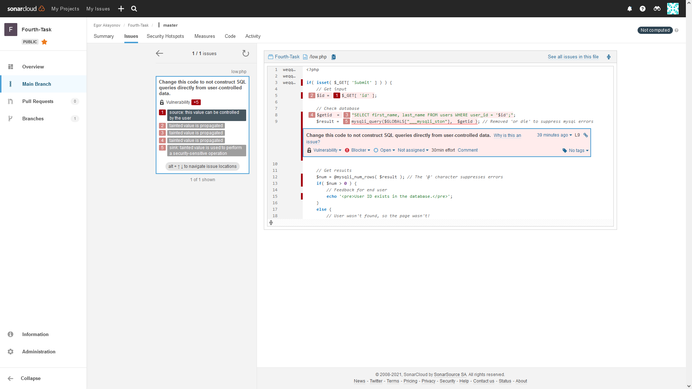
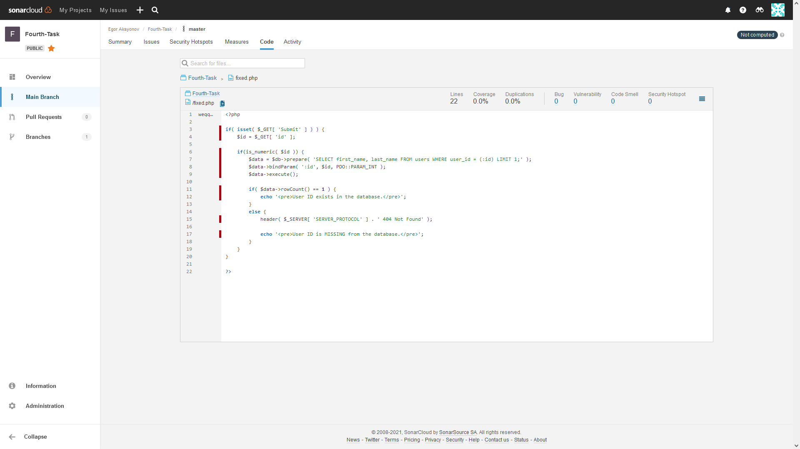

# SAST

## Шаг 1. Нахождение участка кода, содержащий SQL инъекцию

Для нахождения был использован ресурс SonarCloud https://sonarcloud.io

## Шаг 2. Анализ кода и кодревью

В запросе SQL используется прямой ввод, который напрямую контролируется злоумышленником. Все, что им нужно сделать, это выйти из запроса, и тогда они смогут выполнить любой SQL-запрос, который пожелают. 

Значение GET параметра 'id' никаким образом не проверяется перед добавление его в SQL запрос:

> $id = $_GET[ 'id' ];

Оно записывается в переменную `$id`, далее с помощью этой переменной формируется запрос и успешно выполняется на стороне сервера:

> $getid  = "SELECT first_name, last_name FROM users WHERE user_id = '$id';";
> 
> $result = mysqli_query($GLOBALS["___mysqli_ston"],  $getid );

Отсюда возникает код уязвимый к SQL-инъекциям

Пример:

> ?id=1' AND sleep 5&Submit=Submit

## Шаг 3. Исправление участка кода

- Запросы теперь являются параметризованными запросами (а не динамическими). Это означает, что запрос был определен разработчиком и различал, какие разделы являются кодом, а все остальное - данными.
- Добавлено использование функции `is_numeric()` для проверки вводимого значения `id`

Результат анализа исправленного кода:

